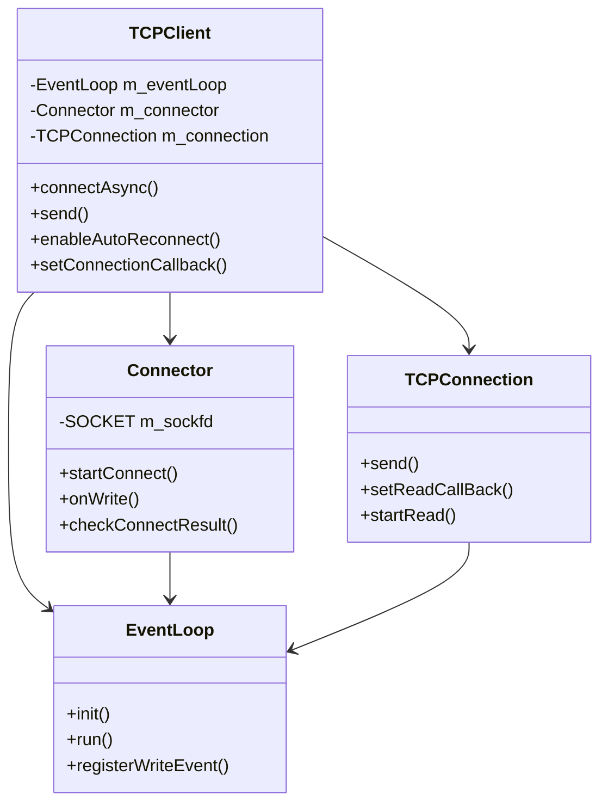

# TCPClient 异步网络客户端

## 概述

TCPClient 是基于 Reactor 模式设计的异步网络客户端，完美复用了服务端的网络基础设施。适用于需要高性能、低延迟的客户端应用，特别是 IM 系统、游戏客户端等实时通信场景。

## 架构设计

### 核心组件

```
TCPClient (客户端主类)
├── EventLoop (事件循环) - 复用服务端组件
├── Connector (连接器) - 新增客户端组件
├── TCPConnection (连接管理) - 复用服务端组件  
├── Buffer (缓冲区) - 复用服务端组件
└── 网络线程管理
```

### 类图关系



## API 文档

### TCPClient 主要接口

#### 连接管理
```cpp
// 异步连接 (推荐)
bool connectAsync(const std::string& serverIP, uint16_t serverPort, uint32_t timeoutMs = 5000);

// 同步连接 (阻塞版本)
bool connect(const std::string& serverIP, uint16_t serverPort, uint32_t timeoutMs = 5000);

// 断开连接
void disconnect();

// 状态查询
bool isConnected() const;
bool isConnecting() const;
```

#### 生命周期管理
```cpp
// 启动客户端 (在独立线程中运行事件循环)
void start();

// 停止客户端
void stop();
```

#### 数据发送
```cpp
// 发送数据
bool send(const char* data, size_t len);
bool send(const std::string& data);
```

#### 高级功能
```cpp
// 自动重连设置
void enableAutoReconnect(bool enable, uint32_t intervalMs = 3000, uint32_t maxAttempts = 0);

// 心跳设置
void enableHeartbeat(bool enable, uint32_t intervalMs = 30000);
```

#### 回调设置
```cpp
// 连接成功回调
void setConnectionCallback(ClientConnectionCallback&& callback);

// 连接断开回调
void setDisConnectionCallback(ClientDisConnectionCallback&& callback);

// 连接失败回调
void setConnectFailedCallback(ClientConnectFailedCallback&& callback);
```

### Connector 接口

```cpp
// 发起异步连接
bool startConnect(const std::string& serverIP, uint16_t serverPort, uint32_t timeoutMs = 5000);

// 取消连接
void cancelConnect();

// 设置回调
void setConnectCallback(ConnectCallback&& callback);
void setConnectFailedCallback(ConnectFailedCallback&& callback);
```

## 使用示例

### 1. 基本使用

```cpp
#include "TCPClient.h"

TCPClient client;

// 设置连接成功回调
client.setConnectionCallback([](std::shared_ptr<TCPConnection>& conn) {
    std::cout << "Connected to server!" << std::endl;
    
    // 设置数据接收回调
    conn->setReadCallBack([](Buffer& buffer) {
        std::string data = buffer.retrieveAllAsString();
        std::cout << "Received: " << data << std::endl;
    });
    
    // 发送数据
    conn->send("Hello Server!");
});

// 异步连接
if (client.connectAsync("127.0.0.1", 8080)) {
    client.start();
    
    // 程序继续运行...
    std::this_thread::sleep_for(std::chrono::seconds(10));
    client.stop();
}
```

### 2. IM 客户端示例

```cpp
class IMClient {
private:
    TCPClient m_client;
    
public:
    void connectToServer() {
        // 启用自动重连
        m_client.enableAutoReconnect(true, 3000, 10);
        
        // 启用心跳保活
        m_client.enableHeartbeat(true, 30000);
        
        // 设置回调
        m_client.setConnectionCallback([this](auto& conn) {
            onConnected(conn);
        });
        
        m_client.setDisConnectionCallback([this](auto& conn) {
            onDisconnected();
        });
        
        // 连接服务器
        m_client.connectAsync("im.server.com", 8080);
        m_client.start();
    }
    
    void sendMessage(const std::string& message) {
        if (m_client.isConnected()) {
            // 按照IM协议格式化消息
            std::string formatted = formatIMMessage(message);
            m_client.send(formatted);
        }
    }
    
private:
    void onConnected(std::shared_ptr<TCPConnection>& conn) {
        // 设置消息接收处理
        conn->setReadCallBack([this](Buffer& buffer) {
            handleIMMessage(buffer);
        });
        
        // 发送登录信息
        sendLoginRequest();
    }
    
    void handleIMMessage(Buffer& buffer) {
        // 解析IM协议消息
        std::string data = buffer.retrieveAllAsString();
        // 处理不同类型的消息...
    }
};
```

### 3. 多客户端连接

```cpp
std::vector<std::unique_ptr<TCPClient>> clients;

for (int i = 0; i < 10; ++i) {
    auto client = std::make_unique<TCPClient>();
    
    client->setConnectionCallback([i](auto& conn) {
        std::cout << "Client " << i << " connected!" << std::endl;
        conn->send("Hello from client " + std::to_string(i));
    });
    
    if (client->connectAsync("127.0.0.1", 8080)) {
        client->start();
        clients.push_back(std::move(client));
    }
}
```

## 特性说明

### 1. 异步非阻塞

- **完全异步**: 所有网络操作都在独立线程中进行
- **不阻塞主线程**: UI 线程永远保持响应
- **事件驱动**: 基于 Reactor 模式，高效处理网络事件

### 2. 自动重连机制

```cpp
// 启用自动重连
client.enableAutoReconnect(
    true,    // 启用
    3000,    // 重连间隔 3秒
    10       // 最大重连次数，0表示无限重连
);
```

### 3. 心跳保活

```cpp
// 启用心跳
client.enableHeartbeat(
    true,    // 启用
    30000    // 心跳间隔 30秒
);
```

### 4. 线程安全

- 内部使用 `std::mutex` 保护关键数据
- 回调函数在网络线程中执行
- 与 Qt 等 UI 框架集成时需要使用信号槽

### 5. 资源管理

- RAII 设计，自动管理资源
- 异常安全，确保资源正确释放
- 智能指针管理对象生命周期

## 与 Qt 集成

### 信号槽模式

```cpp
class NetworkManager : public QObject {
    Q_OBJECT
    
private:
    TCPClient m_client;
    
public:
    void connectToServer() {
        m_client.setConnectionCallback([this](auto& conn) {
            // 网络线程 -> UI线程
            emit connected();
            
            conn->setReadCallBack([this](Buffer& buffer) {
                QString data = QString::fromStdString(buffer.retrieveAllAsString());
                emit messageReceived(data);
            });
        });
        
        m_client.connectAsync("server.com", 8080);
        m_client.start();
    }
    
signals:
    void connected();
    void disconnected();
    void messageReceived(const QString& message);
};

// 在UI类中
connect(networkManager, &NetworkManager::messageReceived,
        this, &ChatWindow::displayMessage,
        Qt::QueuedConnection);  // 异步调用，线程安全
```

## 性能特点

### 1. 内存使用

- **低内存占用**: 每个客户端约几KB内存
- **缓冲区复用**: 使用高效的环形缓冲区
- **对象池**: 可扩展为连接池模式

### 2. 网络性能

- **零拷贝**: 尽可能减少数据拷贝
- **批量处理**: 事件循环批量处理网络事件
- **适应性**: 自动适应网络状况

### 3. 扩展性

- **水平扩展**: 支持大量并发连接
- **模块化**: 组件可独立替换和升级

## 错误处理

### 连接错误

```cpp
client.setConnectFailedCallback([]() {
    // 处理连接失败
    std::cout << "Connection failed, check network settings" << std::endl;
});
```

### 网络异常

```cpp
client.setDisConnectionCallback([](auto& conn) {
    // 处理意外断开
    std::cout << "Connection lost, will auto-reconnect if enabled" << std::endl;
});
```

### 异常安全

- 所有操作都有异常保护
- 资源自动清理
- 状态一致性保证

## 编译和依赖

### 依赖库

```
Windows: ws2_32.lib
Linux: pthread
```

### 编译选项

```cmake
# CMakeLists.txt 示例
target_link_libraries(your_project 
    net  # 您的网络库
    $<$<PLATFORM_ID:Windows>:ws2_32>
    $<$<PLATFORM_ID:Linux>:pthread>
)
```

## 最佳实践

### 1. 连接管理

```cpp
// ✅ 推荐：使用异步连接
client.connectAsync("server.com", 8080);

// ❌ 避免：同步连接会阻塞线程
// client.connect("server.com", 8080);
```

### 2. 生命周期

```cpp
// ✅ 推荐：明确的生命周期管理
class MyApp {
    TCPClient client;
public:
    ~MyApp() {
        client.stop();  // 确保正确停止
    }
};
```

### 3. 错误处理

```cpp
// ✅ 推荐：完整的错误处理
client.setConnectionCallback([](auto& conn) { /* 成功 */ });
client.setConnectFailedCallback([]() { /* 失败 */ });
client.setDisConnectionCallback([](auto& conn) { /* 断开 */ });
```

### 4. 数据处理

```cpp
// ✅ 推荐：高效的数据处理
conn->setReadCallBack([](Buffer& buffer) {
    // 尽快处理数据，避免阻塞网络线程
    std::string data = buffer.retrieveAllAsString();
    processDataAsync(data);  // 异步处理
});
```

## 故障排除

### 常见问题

1. **连接失败**
   - 检查服务器地址和端口
   - 确认防火墙设置
   - 验证网络连通性

2. **频繁断开**
   - 启用心跳保活
   - 检查网络稳定性
   - 调整重连参数

3. **内存泄漏**
   - 确保调用 `stop()`
   - 检查回调函数中的循环引用

### 调试建议

```cpp
// 启用详细日志
client.setConnectionCallback([](auto& conn) {
    std::cout << "Connected to " << conn->getPeerAddress() << std::endl;
});

client.setDisConnectionCallback([](auto& conn) {
    std::cout << "Disconnected, reason: " << conn->getCloseReason() << std::endl;
});
```

## 总结

TCPClient 提供了一个完整的异步网络客户端解决方案，特别适合：

- ✅ **IM 客户端**: 实时消息、自动重连、心跳保活
- ✅ **游戏客户端**: 低延迟、高并发、稳定连接  
- ✅ **物联网设备**: 轻量级、自动恢复、长连接
- ✅ **API 客户端**: 异步请求、连接复用、错误处理

通过复用服务端的 Reactor 架构，实现了客户端和服务端技术栈的统一，降低了学习成本和维护复杂度。 