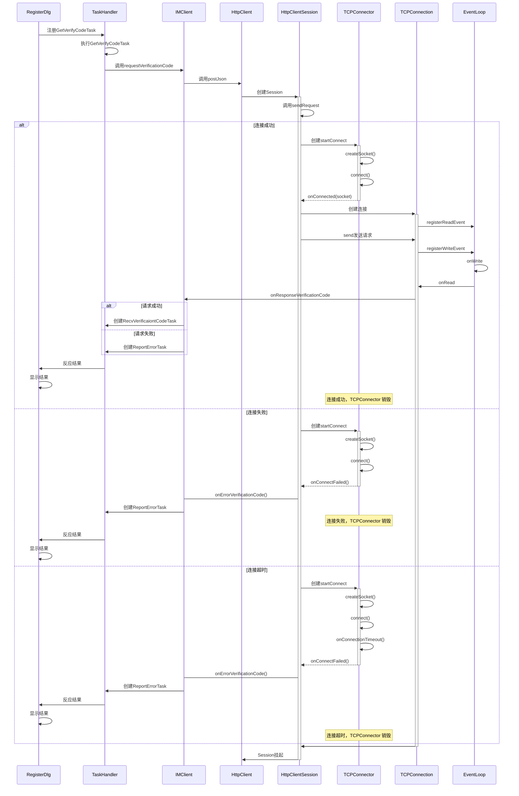

```mermaid
sequenceDiagram
	participant RegisterDlg
	participant TaskHandler
	participant IMClient
	participant HttpClient
	participant HttpClientSession
	Participant TCPConnector
	Participant TCPConnection
	Participant EventLoop
	RegisterDlg->>TaskHandler:注册GetVerifyCodeTask
	TaskHandler->>TaskHandler:执行GetVerifyCodeTask
	TaskHandler->>IMClient:调用requestVerificationCode
	IMClient->>HttpClient:调用postJson
	HttpClient->>+HttpClientSession:创建Session
	HttpClientSession->>HttpClientSession:调用sendRequest
	alt 连接成功
		HttpClientSession->>+TCPConnector:创建startConnect
		TCPConnector->>TCPConnector:createSocket()
		TCPConnector->>TCPConnector:connect()
    	TCPConnector-->>-HttpClientSession:onConnected(socket)
    	HttpClientSession->>+TCPConnection:创建连接
    	TCPConnection->>EventLoop:registerReadEvent
    	HttpClientSession->>TCPConnection:send发送请求
    	TCPConnection->>EventLoop:registerWriteEvent
    	EventLoop->>EventLoop:onWrite
    	EventLoop->>TCPConnection:onRead
    	TCPConnection->>IMClient:onResponseVerificationCode
    	alt 请求成功
    		IMClient->>TaskHandler:创建RecvVerificaiontCodeTask
    	else 请求失败
    		IMClient->>TaskHandler:创建ReportErrorTask
    	end
    	TaskHandler->>RegisterDlg:反应结果
    	RegisterDlg->>RegisterDlg:显示结果
    	Note over TCPConnector: 连接成功，TCPConnector 销毁
	else 连接失败
		HttpClientSession->>+TCPConnector:创建startConnect
		TCPConnector->>TCPConnector:createSocket()
		TCPConnector->>TCPConnector:connect()
    	TCPConnector-->>-HttpClientSession:onConnectFailed()
		HttpClientSession->IMClient:onErrorVerificationCode()
		IMClient->>TaskHandler:创建ReportErrorTask
    	Note over TCPConnector: 连接失败，TCPConnector 销毁
    	TaskHandler->>RegisterDlg:反应结果
    	RegisterDlg->>RegisterDlg:显示结果
	else 连接超时
		HttpClientSession->>+TCPConnector:创建startConnect
		TCPConnector->>TCPConnector:createSocket()
		TCPConnector->>TCPConnector:connect()
    	TCPConnector->>TCPConnector:onConnectionTimeout()
    	TCPConnector-->>-HttpClientSession:onConnectFailed()
		HttpClientSession->IMClient:onErrorVerificationCode()
		IMClient->>TaskHandler:创建ReportErrorTask
		TaskHandler->>RegisterDlg:反应结果
    	RegisterDlg->>RegisterDlg:显示结果
    	Note over TCPConnector: 连接超时，TCPConnector 销毁    	
	end
	    TCPConnection->>-HttpClientSession:
	    HttpClientSession->>-HttpClient:Session挂起
	
```

